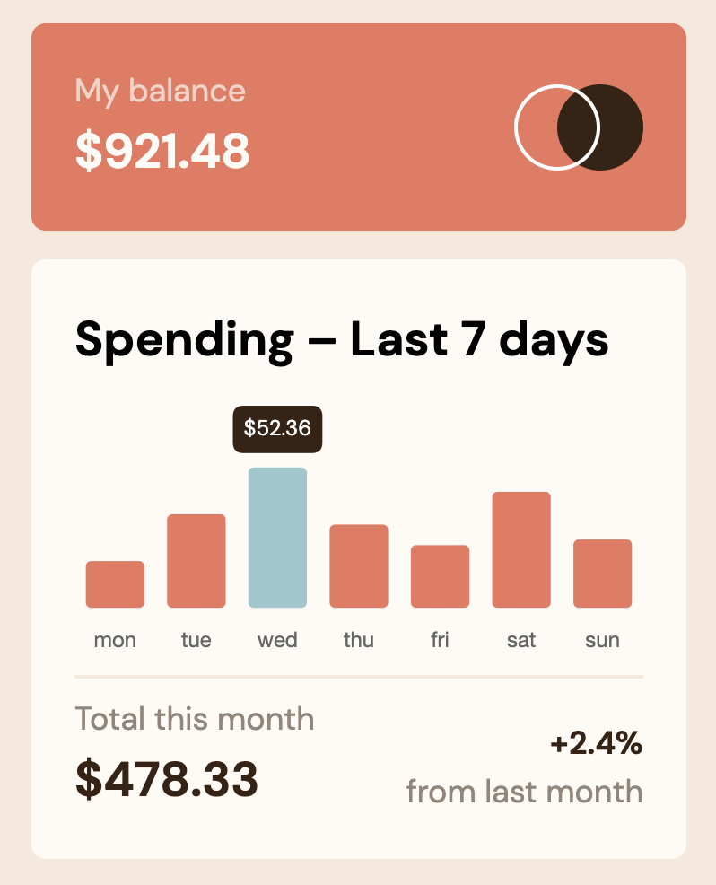

# Frontend Mentor - Expenses chart component solution

This is a solution to the [Expenses chart component challenge on Frontend Mentor](https://www.frontendmentor.io/challenges/expenses-chart-component-e7yJBUdjwt). Frontend Mentor challenges help you improve your coding skills by building realistic projects.

## Table of contents

- [Overview](#overview)
  - [The challenge](#the-challenge)
  - [Screenshot](#screenshot)
  - [Links](#links)
- [My process](#my-process)
  - [Built with](#built-with)
  - [What I learned](#what-i-learned)
  - [Continued development](#continued-development)
  - [Useful resources](#useful-resources)
- [Author](#author)

**Note: Delete this note and update the table of contents based on what sections you keep.**

## Overview

### The challenge

Users should be able to:

-✅ View the bar chart and hover over the individual bars to see the correct amounts for each day
-✅ See the current day’s bar highlighted in a different color to the other bars
-✅ View the optimal layout for the content depending on their device’s screen size
-✅ See hover states for all interactive elements on the page
-✅✅ **Bonus**: Use the JSON data file provided to dynamically size the bars on the chart

### Screenshot

### Links

- Solution URL: [Github Repo](https://github.com/willetto/Frontend-Mentor-Chart-Component)
- Live Site URL: [Github Pages](https://willetto.github.io/Frontend-Mentor-Chart-Component/)

## My process

### Built with

- Chart.js
- Semantic HTML5 markup
- CSS custom properties
- CSS Grid
- Mobile-first workflow

### What I learned

I had never used chart.js before, but I was able to look into the documentation and figure out all of the customization I needed. It was incredibly fulfilling to puzzle through.

I also needed to brush up on my async/await functions to successfully pull in the JSON data file, because the chart was loading before the data was parsed.

### Continued development

I want to do a few tutorials and projects using chart JS to make some other tools with real-world application.

### Useful resources

- [CHart.js Documentation](https://www.chartjs.org/docs/latest/) - It took a little digging, but I was able to get what I needed from this.

## Author

- Website - [TreyWilletto.com](https://www.treywilletto.com)
- Frontend Mentor - [@willetto](https://www.frontendmentor.io/profile/willetto)
